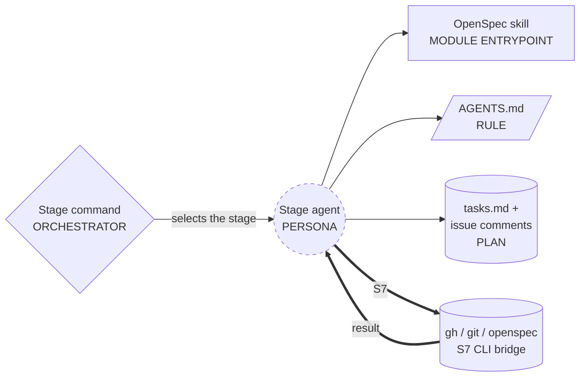
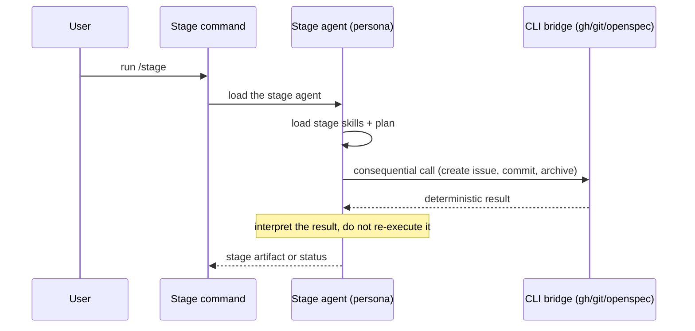
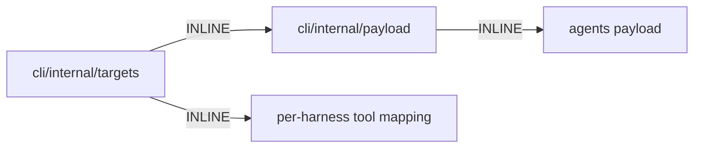

# Agent standard genesis pass (gh-46)

Date: 2026-09-30
Change: `gh-46-agentes-multi-herramienta`
Scope: the per-stage agent primitives and their tool (permission) surface.

## Step 1 - intent + scope

Capability: octospec defines one scoped agent per stage of the loop, each with
an explicit tool surface, rendered natively per harness from one canonical
source.

Triggers: `/idea`, `/spec`, `/apply`, `/ship`, `/archive`.

Boundary: it does NOT define skills, does NOT orchestrate runs, and does NOT
manage model credentials. The OpenSpec skills stay owned by the `openspec` CLI.

Cost stance: `balanced`.

Primitive classification (substrate):
- PERSONA SCOPING FILE: the stage agent (new).
- MODULE ENTRYPOINT: the OpenSpec skill each stage loads (existing).
- SCOPE-ATTACHED RULE: `AGENTS.md` for the developing repo (existing).
- ORCHESTRATOR: the stage command that selects the agent (existing).
- PLAN PERSISTENCE: `tasks.md` and the issue comments (existing).

## Step 2 - component diagram

## Step 3 - sequence diagram

## Step 3.1 - tradeoff

B15 TOOL SUBSET, not IMPLICIT FULL SURFACE. Every stage declares only the
capabilities it uses. The subset is decided at agent entry and held.

## Step 3.2 - cost

- Role class per stage: idea and spec are `thinking` (planner); apply is
  `implementer`; ship and archive are `reviewer`.
- B12 MODEL ROUTER binds `role` to a concrete model at codegen, through the
  one model configuration. The agent definition never names a model.
- No fan-out inside the agent definitions. Spawn, when it appears, is a
  runtime concern of a stage command, not of the persona.

## Step 3.5 - composition

All INLINE in the CLI payload. No external modules.

## Step 4 - SoC pass

- No existing module defines a stage agent; the OpenSpec skills are separate
  modules and stay separate.
- No dispatch collision: the persona `description` is distinct from each
  skill's `description`.
- S7 fires on every stage. The consequential calls (`gh issue create`,
  `git commit`, `git push`, `openspec archive`, `gh api PATCH`) cross the CLI
  bridge. Each agent body must state that a side effect is never claimed
  without the tool call.
- B15 fires on every stage. The tool surface is declared, and the body must
  not name a tool outside the subset.

## Step 5 - compliance

- Safety Boundaries: resolved by the explicit tool surface.
- Portability: `pi` has no documented persona or permission field, so its
  reach is ADVISORY. `codex` has no persona file at all, so it is
  UNSUPPORTED for discrete agents. Both are declared, not silent.
- WRONG-PRIMITIVE BINDING avoided: `tools` is only rendered where the harness
  frontmatter accepts it.

## Step 6 - handoff packet

### Canonical agent fields (substrate-level)

`name`, `stage`, `role`, `description`, `skills`, `tools`, `writes`.

`tools` is a capability-group allowlist (B15): `read`, `edit`, `search`,
`shell`, `web`, `agent`.

### Per-harness binding

The canonical body stays substrate-only. The deployer (`targets`) emits the
harness syntax.

| Canonical | Claude Code `tools:` | Copilot `tools:` | opencode `permissions` | pi (advisory) |
|---|---|---|---|---|
| read | Read, Glob, Grep | read | read | read |
| edit | Edit, Write | edit | edit | edit |
| search | Grep, Glob | search | grep | search |
| shell | Bash | execute | bash | shell |
| web | WebFetch, WebSearch | web | webfetch | web |
| agent | Task | agent | task | agent |

Binding sites:
- Claude Code: `.claude/agents/<name>.md`, frontmatter `tools`, `model`.
- opencode: `.opencode/agents/<name>.md` or `~/.config/opencode/agents/<name>.md`,
  frontmatter `permissions`, `model`.
- GitHub Copilot: `.github/agents/<name>.agent.md`, frontmatter `tools`
  (aliases), `model`.
- pi: `~/.pi/agent/agents/<name>.md`, a prompt template. No permission field,
  so the scope is advisory in the body.
- codex: no persona file. Not a target for a discrete agent.

### Declared target support

| Harness | Discrete agent | Tool scope |
|---|---|---|
| claude | yes | enforced |
| opencode | yes | enforced |
| copilot | yes | enforced |
| pi | yes | advisory |
| codex | no | unsupported |

### Stage tool matrix

| Stage | Role | tools |
|---|---|---|
| idea | thinking | read, search, shell |
| spec | thinking | read, search, edit, shell |
| apply | implementer | read, search, edit, shell |
| ship | reviewer | read, search, shell |
| archive | reviewer | read, search, edit, shell |

### Compliance findings still open

- None blocking. The pi and codex gaps are declared above.

### Todos

- Add `tools` to the canonical agent format and to the five agent files.
- Map canonical tools per harness in the renderer.
- Fix the opencode agent directory to `agents` and the Copilot extension to
  `.agent.md`.
- Add the portability note to the standard doc and the spec.
- Tests for the tool rendering and the declared support levels.

### Cost projection

- One agent per stage, one model per role. No fan-out in the design.
- Typical run: five stages, each a single thread. Input is the stage context
  plus the agent body; output is one artifact.
- Bands: idea and spec run planner-class, apply runs implementer-class, ship
  and archive run reviewer-class. B12 binds the concrete SKU at codegen.

## Step 7a - portability check

The canonical body uses substrate vocabulary only. The harness syntax lives in
the deployer. `pi` and `codex` reach beyond the substrate and are declared in
the target support table.

## Step 8 - validate

- Each agent carries `name`, `stage`, `role`, `description`, `skills`,
  `tools`, `writes`, and a body.
- The body names only tools inside its subset.
- `tools` renders in harness syntax where the harness accepts it, and as an
  advisory body line for `pi`.
